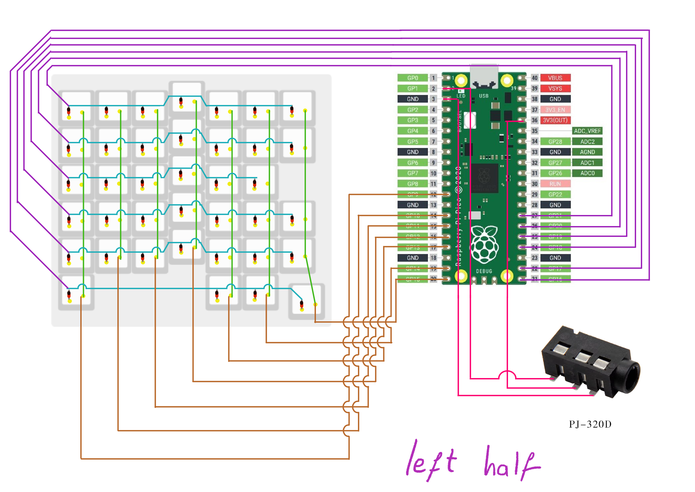

# Ergo Mibbbbbn - DIY Ergonomic Split Keyboard

## 🎯 AIM

Print and assemble your new **mechanical, ergonomic, split, Italian QWERTY layout-based, column-staggered, hand-wired keyboard**!

Ergo Mibbbbbn was born to meet the needs of users looking for a **comfortable**, **affordable**, and **Italian-layout-compatible** keyboard. The goal is to provide a device that can be used **without "forgetting"** the standard Italian keyboard layout. Most keys are mapped to the traditional QWERTY IT layout, so writing long documents in Italian feels natural, with symbols and accented letters in their usual spots.

This repo includes firmware for the Italian layout, but you're free to modify the working QMK code to suit your preferences and flash it onto your Raspberry Pi Picos.

The chassis is designed for:
- A small thumb cluster
- Column-staggered keys
- Hand-wired design

<!-- BREAKPOINT -->
<div align="center">
   
</div>
<!-- BREAKPOINT -->

Every 3D piece was designed using Fusion 360, and CAD files are available for further customization. The plate supports standard MX switches. Note: 3D-printed plates may require post-processing depending on your printer settings to ensure a correct fit for the switches.
<!-- BREAKPOINT -->
<div align="center">
   
</div>
<!-- BREAKPOINT -->

---
## ⚡​ FLASHING

QMK was written so each half uses the same firmware build, but it is important to **connect the right half to the computer**.

If **no firmware modifications** are needed, flash the firmware build onto your two Raspberry Pi Picos:

1. Connect the first Pico to your computer while holding the boot button.
2. Drag and drop the `.uf2` firmware file into the Pico.
3. Repeat for the second half of the keyboard.
4. Connect the two halves via the TRS cable.
5. Connect the **right** half to the PC.

If **firmware modifications** were made, use the following steps:

1. Open the QMK MYSYS terminal.
2. Run:
   ```bash
   qmk compile -kb ergo_mibbbbbn -km default
3. Flash new firmware following the steps above
---

## 💅​ LAYERS

A second layer is used to enable mouse controls directly from the keyboard.

- **Tapping the `<` key** provides regular keyboard input.
- **Holding the `<` key** activates mouse control mode:
  - **E / S / D / F**: Move the cursor (↑ ← ↓ →)
  - **ALT**: Mouse click 1
  - **SPACE**: Mouse click 2
  - **WIN**: Mouse click 3
  - **W**: Left Control
  - **R**: Left Shift
  - **T**: Scroll wheel up
  - **G**: Scroll wheel down

---
## 🪢​ WIRING
<!-- BREAKPOINT -->
Make sure to have some sort of **isolation** where a column wire and a row wire intersect  
---
<!-- BREAKPOINT -->
<div align="center">
   
</div>
<!-- BREAKPOINT -->
<div align="center">
   
   
</div>
<!-- BREAKPOINT -->

*An additional button was soldered to the RIGHT side to wake up the keyboard at the first boot of the pc*
<!-- BREAKPOINT -->
<div align="center">
   
</div>
<!-- BREAKPOINT -->

---
## 🧱​ MATERIALS

### Chassis:
- `left_case_ergo_mibbbbbn` ×1  
- `right_case_ergo_mibbbbbn` ×1  
- `left_plate_ergo_mibbbbbn` ×1  
- `right_plate_ergo_mibbbbbn` ×1  
- `left_rise_ergo_mibbbbbn` ×1 *(optional)*  
- `right_rise_ergo_mibbbbbn` ×1 *(optional)*  
- `TRS_interface_cover_ergo_mibbbbbn` ×2 *(optional)*  

### Electronics & Hardware:
- MX-like switches ×77
- Raspberry Pi Pico ×2  
- TRS interface PJ320D ×2  
- TRS cable ×1  
- IN4148 diodes ×77  
- M2×8 screws (or slightly different) ×32  
- Electric wire  

## 🧢 KEYCAPS

Custom fdm 3D-printed low-profile keycaps are currently in development.
